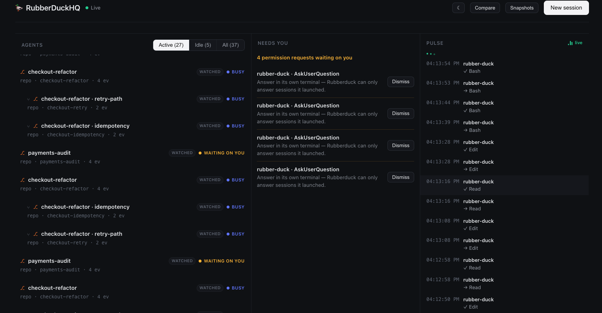

<div align="center">

# 🦆 Rubberduck

### One window over every AI coding agent you run.

Launch Claude Code, Codex, or Copilot into isolated git worktrees, watch them
work side by side, fork a session into a tree of attempts, and answer their
prompts — all from one local dashboard. Your code and keys never leave your machine.

**[Install](#install) · [Features](#what-it-does) · [Dashboard](#the-dashboard) · [Using it](#using-it)**

Works with **Claude Code · Codex · GitHub Copilot CLI · any CLI agent**

</div>

---



## Install

```sh
pipx install rubberduckhq        # pipx keeps it isolated; `pip install` works too
rubberduck serve                 # run the server + dashboard at :4200
```

Requires Python 3.11+. The package has **no Python dependencies** — the
dashboard and hook script ship inside it. Open **http://localhost:4200**.

That alone gets you the dashboard and lets you launch agents from it. (Use
`pipx`, a venv, or `--user` — modern macOS/Linux block `pip install` into the
system Python.)

### To watch agents you start yourself

Watching a session you started in your own terminal needs two more things:

1. **System tools the hook uses** — `jq` and `curl` (curl is usually already
   present):

   ```sh
   brew install jq            # macOS;  apt install jq / dnf install jq on Linux
   ```

2. **Wire the agent's hooks**, then start a fresh session:

   ```sh
   rubberduck install-hooks --global --agent claude-code   # or codex, copilot
   ```

   Start the agent normally — its sessions now appear in the dashboard.

**Codex needs one extra, one-time step:** Codex won't run a hook until you
*trust* it. After `install-hooks --agent codex`, start `codex`, run **`/hooks`**,
and trust the Rubberduck hook. (Trust is keyed to the hook script's hash, so
re-trust if Rubberduck updates it. Claude Code and Copilot need no trust step.)

> Note: launching agents into a terminal, "jump to terminal", and answering
> prompts by sending keys to a tab use AppleScript and are **macOS-only**. The
> dashboard and watching work on any platform.

## What it does

### 🪟 One window over every agent
Stop juggling five terminals. Every running session shows up in one dashboard —
what each is doing, which one needs you, and how they relate.

### 🌿 Isolated git worktrees
Run several agents on the same repo without collisions. Each session can get its
own git worktree on its own branch; merge any branch back with a normal
`git merge`. Or run in place when you don't want a branch — your choice per session.

### ⑂ Fork into a tree of attempts
Fork a running session — the code (a new worktree branch) or just the
conversation — and follow the whole lineage as a tree. Try three approaches to
the same problem side by side.

### 🔔 Human in the loop (HITL)
Live state for every session: busy, idle, or waiting on a permission request.
The **Needs human** panel surfaces the sessions waiting on you — answer their
prompts from the dashboard for sessions Rubberduck launched, without switching
terminals.

### 📜 Durable history
Every session is kept with its stated intention and an outcome summary, plus
checkpoints of prompts, files, and tools. Catch up later without re-reading
transcripts.

### 🔒 Local-first and private
The server runs on `127.0.0.1`, gated by a per-install secret so a web page you
visit can't drive it. Rubberduck never sees your code or your API keys.

## The dashboard

`http://localhost:4200` is three columns — your agents, what needs you, and a
live pulse of activity (pictured at the top of this page).

- **Agents** — every session as a row, forks nested under their parent. A badge
  marks each **watched** (you started it) or **launched** (Rubberduck started it
  and can drive it); a `⎇` glyph marks the ones on a git branch. Click a row for
  its detail drawer — timeline, diff, live output, checkpoints, and inline notes.
- **Needs human** — the human-in-the-loop (HITL) panel: sessions waiting on a
  permission request, with inline Approve/Deny for the ones Rubberduck can reach.
- **Pulse** — a live ticker of the latest action across every agent.

## Using it

Two commands: `install-hooks` runs **once** per machine (it persists across
reboots), and `serve` runs **whenever** you want Rubberduck active.

### Claude Code

```sh
rubberduck install-hooks --global
rubberduck serve
```

Start `claude` as usual — sessions appear automatically. The richest
integration: hook events plus the JSONL transcript.

### Codex

```sh
rubberduck install-hooks --agent codex --global
rubberduck serve
```

One extra step: Codex won't run a hook until you trust it. Start `codex`, run
`/hooks`, and trust the Rubberduck hook (re-trust if Rubberduck later updates
the hook script). Use `--global` — Codex's repo-local hooks are unreliable upstream.

### GitHub Copilot CLI

```sh
rubberduck install-hooks --agent copilot --global
rubberduck serve
```

Start `copilot` as usual — sessions appear automatically, no extra steps.

### Bring your own agent

Any CLI agent works through the **launch** path: click **New session** in the
dashboard, point it at a command and a folder. Rubberduck spawns it in a
terminal tab and supervises the process directly — no hooks needed. State is
read from the agent's terminal output, so it's coarser than the hook
integrations above, but it works for anything.

## Two kinds of session

- **Watched** — you start the agent in your own terminal; its hooks report to
  Rubberduck. Rubberduck observes but doesn't own the process, so you drive it
  and answer its prompts in your terminal.
- **Launched** — you click **New session**; Rubberduck opens a terminal tab,
  runs the agent, and owns the process — so you can drive it and answer
  permission requests from the dashboard.

State lives in `~/.rubberduck/` (override with `RUBBERDUCK_HOME`).
